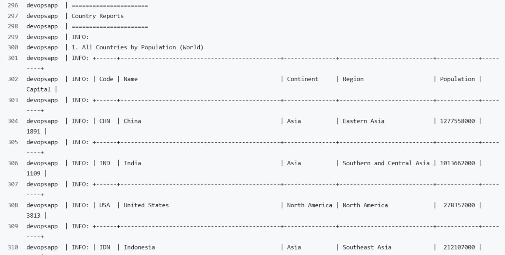
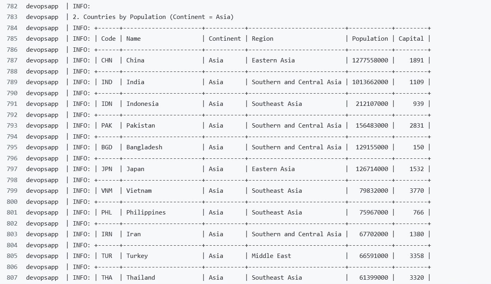
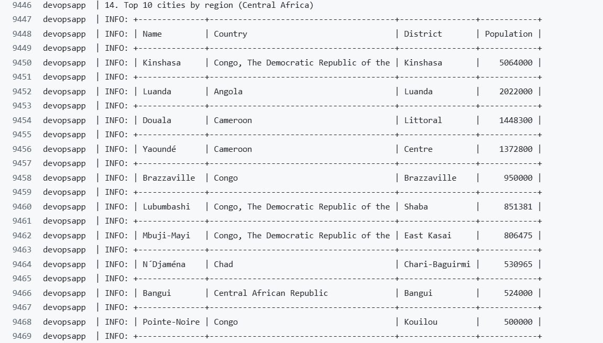
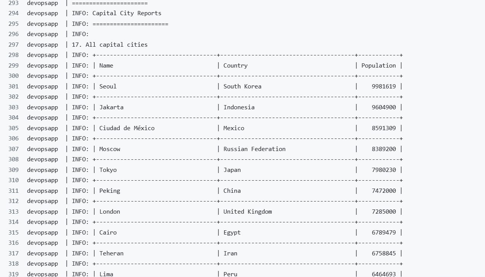
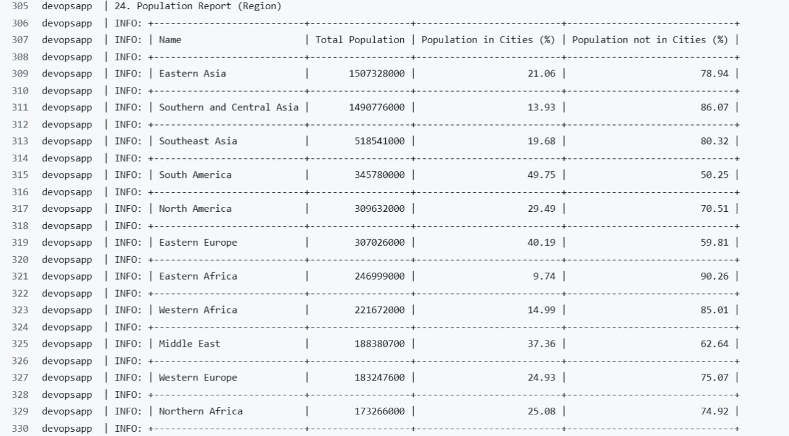
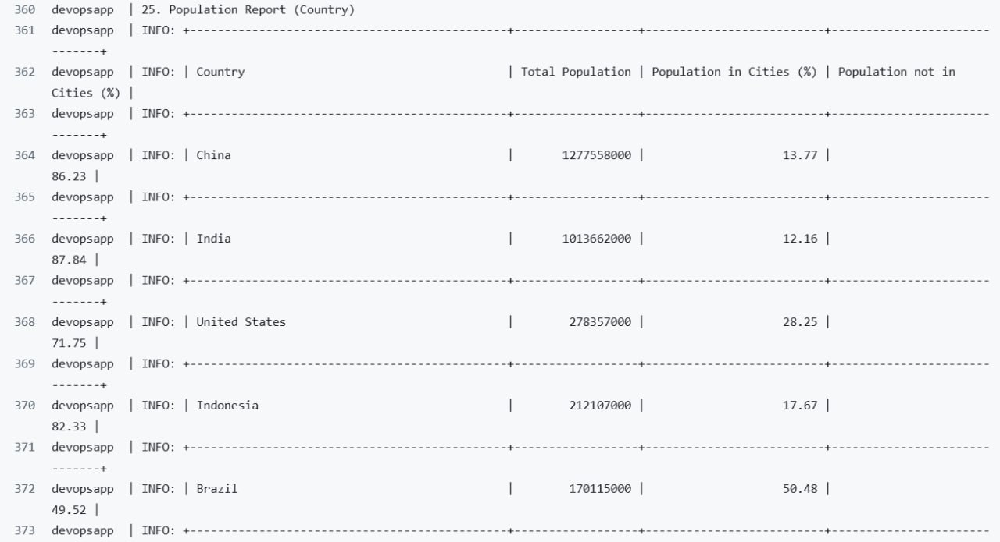
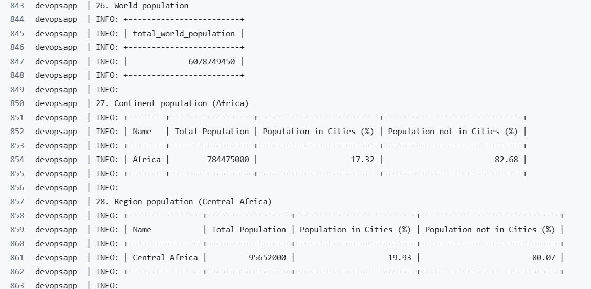
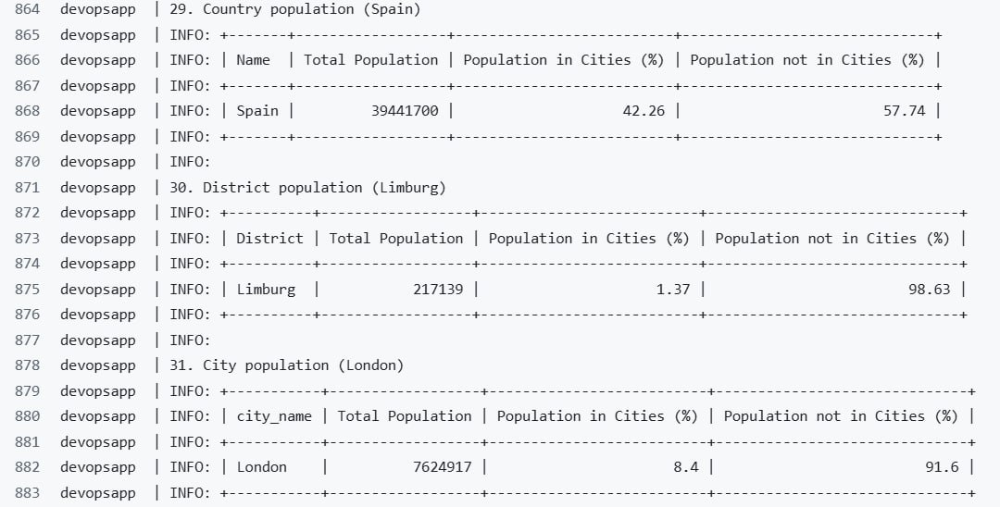

# Population Information Reporting System

This repository is part of the **Software Engineering Methods (SET08803)** coursework project.  
It contains all source code, documentation, and configurations related to the **Population Information Reporting System**, a Java-based application that generates reports using the **world database**.

---

##  Purpose

The purpose of this repository is to:
- Demonstrate the team's ability to collaborate using **Scrum** and **DevOps** practices.
- Show understanding of **Java programming**, **database connectivity**, and **report generation**.
- Implement **continuous integration** and **Dockerized deployment**.
---
## Project Overview

The **Population Information Reporting System** allows users to:
- View population data by **country**, **city**, or **region**.
- Generate formatted population reports.
- Retrieve statistics such as total, urban, and rural populations.
- Access data directly from the **world MySQL database**.

---
## Technologies Used

- **Java** (core application) (jdk-21)
- **MySQL** (world database) (8.0.43-1.ei9)
- **Maven** (build management) (Apache Maven 3.9.11)
- **JUnit** (testing)
- **GitHub Actions** (CI/CD)
- **Docker** & **docker-compose**
- **Zube.io** for Scrum management
---
## Build and License Status

| Branch | Build Status |  
|---------|---------------|  
| **master** |  |  
| **develop** |  |  
---

## Project Badges 

License:

Latest Release:

Code Coverage:

---
## Scrum & Collaboration
This project follows Scrum methodology:
- Managed via Zube.io integrated with GitHub.
- Work is divided into Sprints and User Stories.
- Progress tracked through Kanban Boards.
- Code of Conduct, Use Cases, and Backlog documented in `.md` files.

---

## Team Roles

| Role | Member                                                                                                                                                               | Responsibilities |
|------|----------------------------------------------------------------------------------------------------------------------------------------------------------------------|----------------|
| Product Owner | *[May Thiri Cho](https://github.com/maythiricho)*                                                                                                                    | Defines backlog, ensures requirements meet goals |
| Scrum Master | *[Phyo Zaw Aung](https://github.com/phyozawaung005)*                                                                                                                 | Facilitates Scrum meetings and team workflow |
| Developers/Testers | *[Kyaw Zayar Min](https://github.com/KyawZayarMin1234)*, *[Phyo Thura Kyaw](https://github.com/Segma-tech)*, *[Htet Arkar Saw Naung](https://github.com/Rayyy990)*, *[Hein Htet Lin](https://github.com/heinhtetlin810)* | Implement, test, and document features |

---

## Code of Conduct
All team members must follow the Code of Conduct, ensuring professionalism, collaboration, and academic integrity.  
You can view the full [CODE_OF_CONDUCT.md](./CODE_OF_CONDUCT.md).

---

## License
This project is licensed under the MIT License.  
[View License](./LICENSE)

---

## Version
Current Release: Latest 
[View all releases](https://github.com/maythiricho/SET08803-Group5/releases)

---

## Details the Requirements Met
| ID | Name                                                             | Met | Screenshot                                           |
|----|------------------------------------------------------------------|-----|------------------------------------------------------|
| 1  | All Countries by Population (World)                              | Yes |             |
| 2  | Countries by Population (Contient = Asia)                        | Yes |             |
| 3  | Countries by Population (Region = Carbbean)                      | Yes |             |
| 4  | Top N Countries (World)                                          | Yes |             |
| 5  | Top N Countries (Continent = Europe)                             | Yes |             |
| 6  | Top N Countries (Region = Western Europe)                        | Yes |             |
| 7  | All Cities In World                                              | Yes |             |
| 8  | Cities By continent (Africa)                                     | Yes |             |
| 9  | Cities By Region (Central Africa)                                | Yes |             |
| 10 | Cities By Country (Argentina)                                    | Yes |            |
| 11 | Cities By District (Limburg)                                     | Yes |     |
| 12 | Top 10 Cities In World                                           | Yes |     |
| 13 | Top 10 Cities By Continent (Africa)                              | Yes |            |
| 14 | Top 10 Cities By Region (Central Africa)                         | Yes |            |
| 15 | Top 10 Cities By Country (Argentina)                             | Yes |            |
| 16 | Top 10 Cities By District (Limburg)                              | Yes |            |
| 17 | All Capital Cities                                               | Yes |            |
| 18 | Capitals By Continent (Asia)                                     | Yes |            |
| 19 | Capitals By Region (Eastern Asia)                                | Yes |            |
| 20 | Top 10 Capitals in world                                         | Yes |            |
| 21 | Top 10 Capitals By Continent (Africa)                            | Yes |            |
| 22 | Top 10 Capitals By Region (Western Europe)                       | Yes |            |
| 23 | Population Report (Continent)                                    | Yes |            |
| 24 | Population Report (Region)                                       | Yes |            |
| 25 | Population Report (Country)                                      | Yes |            |
| 26 | World Population                                                 | Yes |  |
| 27 | Continent Population (Africa)                                    | Yes |  |
| 28 | Region Population (Central Africa)                               | Yes |  |
| 29 | Country Population (Spain)                                       | Yes |   |
| 30 | District Population (Limburg)                                    | Yes |   |
| 31 | City Population (London)                                         | Yes |   |
| 32 | Poplation By Language (Chinese, English, Hindi, Spanish, Arabic) | Yes |            |

---

## Contact
If you have questions regarding this coursework:

- **Module:** SET08803 - Software Engineering Methods
- **Institution:** Edinburgh Napier University
- **GitHub Repo:** [maythiricho/SET08803-Group5](https://github.com/maythiricho/SET08803-Group5)
